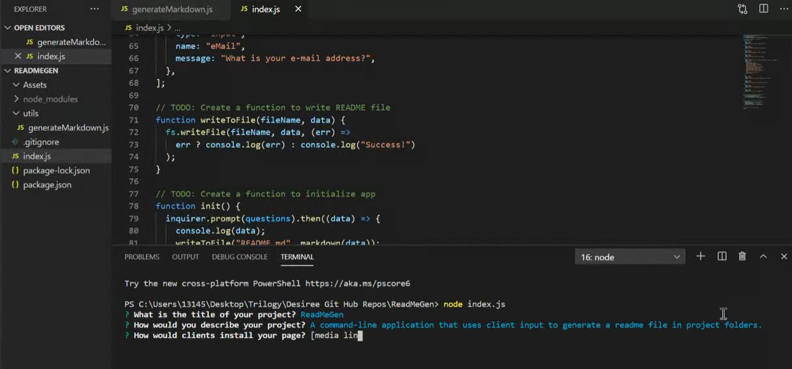

  # ReadMeGen 

  # Description
  A command-line application that uses client input to generate a readme file in project folders.

  ## Table of Contents
    
  1. [Installation](#Install)
  2. [Usage](#Usage)
  3. [Credits](#Credits)
  4. [Test](#Test)
  5. [Contact](#Contact)
  6. [License](#License)

  # Install 

  

  
  
  Repo Link: https://github.com/descoding/readmegen.git 
  
  Video Demo: https://drive.google.com/file/d/1s9q89yy77PopL_zvtELeXIzpmJcc9Q2-/view

  # Usage
  To use, clients would open their project folder in terminal and enter node index.js in the terminal command line.

  # Credits
  Desiree Stout

  # Test
  NodeJS

  # Contact
  If you would like to contact me for questions, or to collaborate, please feel free:
   - GitHub:  DesCoding
   - E-Mail:  d.stout31@yahoo.com

  # License
    MIT  
    [License Badge](https://img.shields.io/badge/License-MIT-yellow.svg)
    
        Copyright 2021  

  Permission is hereby granted, free of charge, to any person obtaining a copy of this software and associated documentation files (the "Software"), to deal in the Software without restriction, including without limitation the rights to use, copy, modify, merge, publish, distribute, sublicense, and/or sell copies of the Software, and to permit persons to whom the Software is furnished to do so, subject to the following conditions:

  The above copyright notice and this permission notice shall be included in all copies or substantial portions of the Software.
    
    [License Link](https://opensource.org/licenses/MIT)
